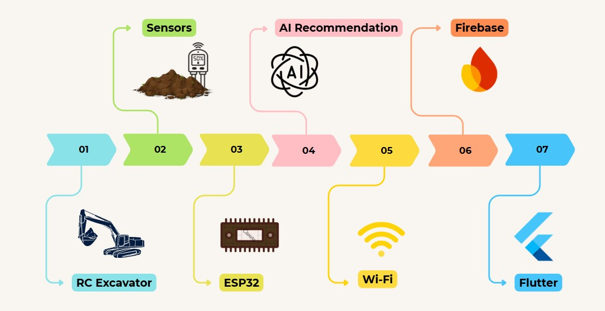
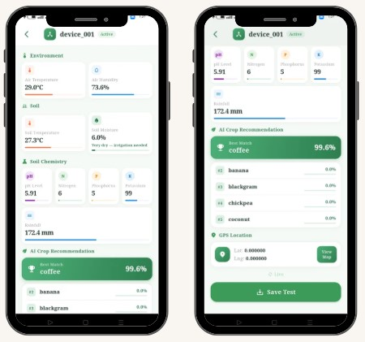
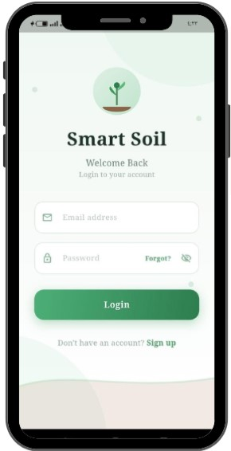
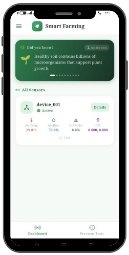
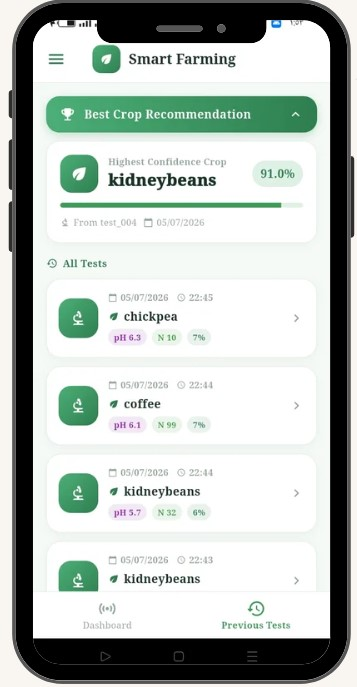
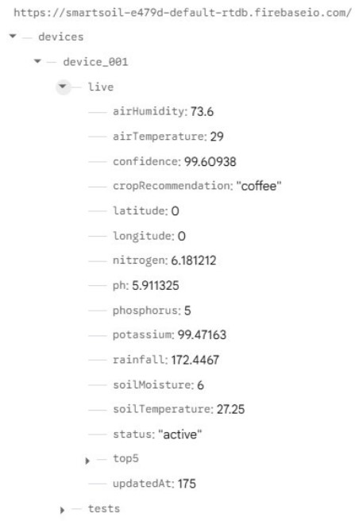

# 🌱 Smart Soil Analysis and Monitoring System Using a Smart Vehicle

An intelligent IoT and TinyML-based system designed to analyze soil conditions and recommend the most suitable crops in real time.

---

# 📖 Project Overview

The Smart Soil Analysis and Monitoring System is an intelligent agricultural solution that combines **IoT**, **TinyML**, **Artificial Intelligence**, and **Mobile Technologies** to help farmers monitor soil conditions and receive real-time crop recommendations.

The system is built around an **ESP32** mounted on a smart RC vehicle equipped with multiple sensors. Sensor data is processed locally using a TinyML model, uploaded to Firebase Realtime Database, and displayed through a Flutter mobile application.

---

# 📷 System Architecture



---

# 🚀 Features

- 🌡️ Real-time environmental monitoring
- 🌱 Soil analysis using multiple sensors
- 🤖 AI-based crop recommendation using TinyML
- ☁️ Firebase Realtime Database integration
- 📱 Flutter mobile application
- 📍 GPS location tracking
- 📊 Test history management
- 📶 Wi-Fi communication between ESP32 and Firebase

---

# 📱 Mobile Application

The Flutter mobile application provides a simple and user-friendly interface for monitoring soil conditions and viewing AI-powered crop recommendations in real time.

## Application Overview



The application allows users to:

- 🔐 User authentication
- 🌡️ View real-time sensor readings
- 🤖 Display AI crop recommendations
- 📍 Display GPS location
- 💾 Save soil test results
- 📊 View previous test history

---

## Login Screen



The login screen allows users to securely access the application using their registered credentials.

---

## Dashboard



The dashboard displays real-time sensor readings together with the AI crop recommendation generated by the TinyML model.

---

## Test History



Users can access previously saved soil tests and review historical sensor readings and crop recommendations.

---
---

# ☁️ Firebase Realtime Database



The Firebase Realtime Database stores:

- Sensor readings
- GPS coordinates
- Crop recommendation results
- Historical test records

---

# 🚜 Smart Vehicle


The smart RC vehicle carries all sensors and the ESP32 board to collect soil data directly from the field.

---

# 🛠️ Hardware Components

- ESP32 Development Board
- DHT22 Temperature & Humidity Sensor
- DS18B20 Soil Temperature Sensor
- HW-080 Soil Moisture Sensor
- GPS NEO-6M Module
- Smart RC Excavator

---

# 💻 Software Technologies

- Arduino IDE
- Flutter
- Firebase Realtime Database
- Edge Impulse
- TinyML
- C++
- Dart

---

# 🧠 Artificial Intelligence Model

- Model Type: Multi-Layer Perceptron (MLP)
- Framework: Edge Impulse TinyML
- Input Features: 7
- Output Classes: 22 Crop Classes
- Optimizer: Adam
- Learning Rate: 0.0005
- Validation Accuracy: **97.9%**

---

# 📂 Repository Structure

```
Smart-Soil-Analysis-and-Monitoring-System
│
├── AI_Model
├── Documentation
├── ESP32_Code
├── Flutter_App
├── Hardware
├── Images
├── Video
│
├── README.md
├── LICENSE
└── .gitignore
```

---

# 📄 Documentation

The complete graduation project report is available in the **Documentation** folder.

---

# 🎥 Project Demonstration

The project demonstration video and presentation are available in the **Video** folder.

---

# 🎓 Project Poster


---

# 👥 Team Members

- Aya Khamaysa
- Suha Abu Hasan
- Tamara Hamarsha

### Supervisor

**Dr. Mahmoud Obaid**

---

# 📜 License

This project is released under the MIT License.
